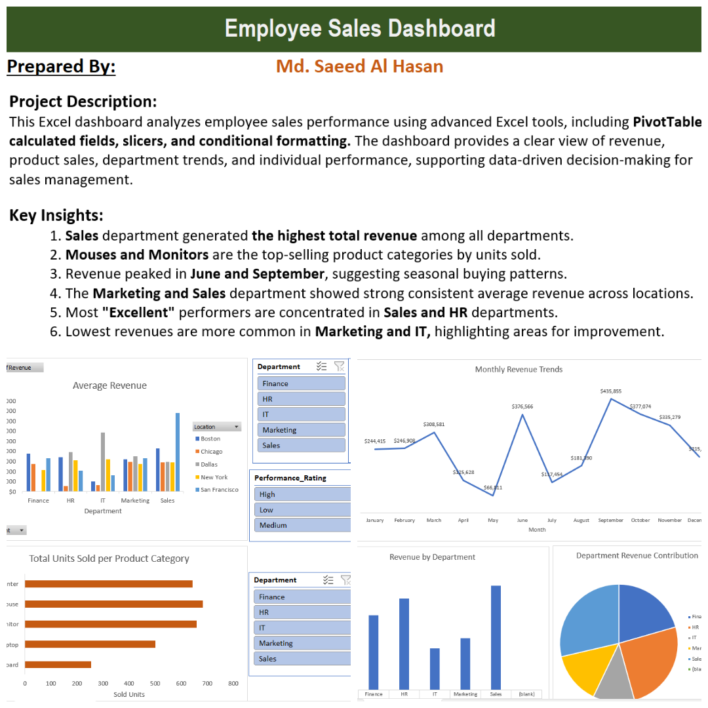

# Employee Sales Dashboard

## Dashboard Preview

## Project Overview
This project is an Excel-based Employee Sales Dashboard designed to analyze and visualize sales performance data across multiple departments in an organization.

## Objectives
- Evaluate individual and team sales performance.
- Track product sales, revenue, and employee KPIs.
- Enable data-driven decision-making for sales management.

## Data Sources
The analysis uses detailed records including employee information, department, location, products sold, units sold, revenue, days off, joining dates, and performance ratings.

## Key Features
- Interactive PivotTables and slicers for dynamic filtering.
- Calculated fields for revenue and performance analysis.
- Conditional formatting highlights top and bottom performers.
- Visual summaries of departmental and product-level trends.

  ## Key Insights
- Sales generated the highest overall revenue in the organization.
- Monitors and Mice were the top products sold by unit.
- Revenue peaked in June and September, indicating seasonality.
- Most "Excellent" performers were found in Sales and HR.

## How to Use
1. Open `Employee Sales Performance.xlsx` in Microsoft Excel.
2. Use dashboard slicers and filters to explore the dataset by employee, department, or product.
3. Review the dashboard for summary insights to support management and HR decisions.

## Technologies Used
- Microsoft Excel (PivotTables, slicers, conditional formatting)
